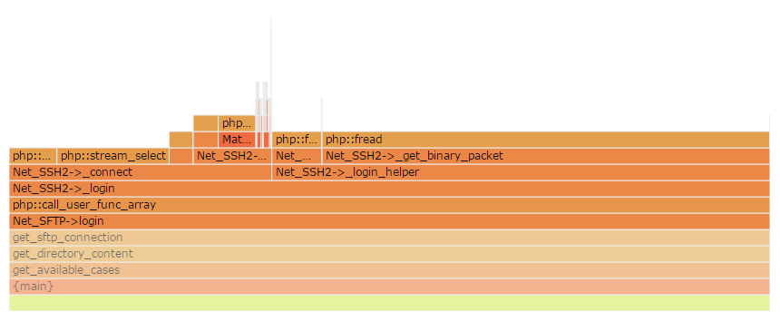

# Xdebug Flamechart

Shows an [Xdebug profile](http://www.xdebug.org/docs/profiler) as a flamechart drawn by [d3-flame-graph](https://github.com/spiermar/d3-flame-graph)

## Link

http://andrekr.github.io/XdebugFlamechart/

## How to use

* Create a profile with Xdebug (see [here](http://www.xdebug.org/docs/profiler#starting) and (for web pages) [here](https://chrome.google.com/webstore/detail/xdebug-helper/eadndfjplgieldjbigjakmdgkmoaaaoc))
* Open the [Viewer](http://andrekr.github.io/XdebugFlamechart/) in a browser
* Drop the Cachegrind file onto that page

## Limitations

* Xdebug does not give information about *when*, within one function, another function is called. The Flamechart just shows all called functions on the left of each calling function

## Source

It's Javascript, so download the HTML file or view it on GitHub: [index.html](https://github.com/AndreKR/XdebugFlamechart/blob/gh-pages/index.html) [converter.inc.js](https://github.com/AndreKR/XdebugFlamechart/blob/gh-pages/converter.inc.js)
